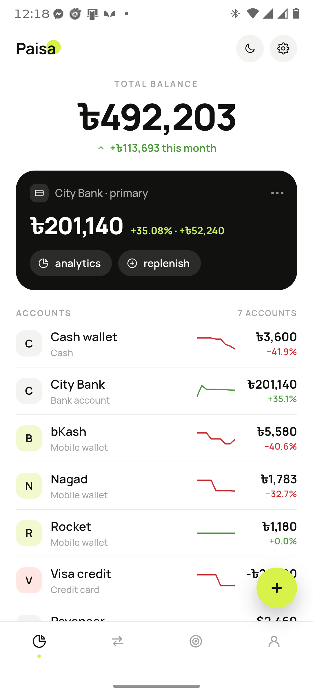

# Paisa

A local-first personal finance tracker for multi-account, multi-currency
spending. Android via Capacitor, real SQLite on device.

Implementation of the `Paisa v4.dc.html` design-canvas prototype
(Claude Design project *Android personal finance tracker*), against the spec in
[docs/design-v4.md](docs/design-v4.md) and the motion system reverse-engineered
from the reference reel in [DESIGN.md](DESIGN.md).



*Running on a Motorola Edge 50 Fusion, Android 16, against on-device SQLite.
More captures in [docs/screens/](docs/screens/).*

## What v4 changed

v4 is a re-cut of the same app, not new features:

- **De-carded.** The sheet is white and rows sit directly on it, split by one
  hairline. There is a maximum of **one dark card per screen** — the primary
  account on Home. The card stack, the panel shadows and the horizontal account
  strip are gone.
- **Icons everywhere.** Stroke icons in the nav, row actions and settings rows;
  account and transaction rows carry a tinted glyph chip. No more text-only
  affordances (`Details`, `All`, `Mark paid` as bare words). The header is the
  exception - it carries a title and nothing else.
- **A different lead per screen.** Home opens on a centred balance, Activity on
  search, Budgets on thin-line rows, Reports on a chart canvas, Settings on a
  grouped list — so the screens stop reading as the same screen four times.
- **Reports is now tabbed** — Overview / Categories / Accounts / Months — with a
  bar canvas and a range strip, and it is reached from the Home card rather than
  from the bar. The bar has four icon-only items and the lime FAB floats clear
  of it instead of being notched into it.

## Running it

**In a browser** — no build step, no emulator:

```bash
npm install
npm run serve          # http://localhost:5173
```

At desktop sizes the app frames itself as a 393×852 artboard. Data persists to
`localStorage` in this mode.

**On Android** — needs the Android SDK and JDK 21:

```bash
npm run build:android  # cap sync + gradle assembleDebug
# -> android/app/build/outputs/apk/debug/app-debug.apk
```

Or `npm run open:android` to work in Android Studio.

## How it is put together

```
www/
  index.html          shell markup: header, scroll region, overlay, nav
  css/
    tokens.css        palette, type, elevation, radii, motion tokens
    fonts.css         bundled Manrope (offline-safe)
    app.css           components
  js/
    app.js            render loop, screen swapping, native wiring
    core/
      store.js        state + every derived money value
      repo.js         storage: SQLite driver | localStorage driver
      sms.js          SMS rule engine
      format.js       currency, dates, percentages
      motion.js       stagger, push, zoom, bar growth
      exporter.js     CSV export and database backup
      dom.js          element builder
    data/
      schema.js       SQLite DDL
      seed.js         first-run contents
    screens/          home, activity, budgets+goals+debts, reports, settings,
                      categories, accounts, scheduled
    sheets/           add/edit transaction, parse SMS, category+account editor,
                      debt, scheduled expense
    ui/
      icons.js        the stroke icon set, built as real SVG nodes
      lucide-paths.js GENERATED - the ~130 icons a user can pick from
      palette.js      the colour swatches a user can pick from
      brands.js       the six payment-network logos
      components.js   rows, chips, tabs, bars, section headers
      datepicker.js   the floating calendar: days, months, years
  core/calc.js        the keypad's expression evaluator
scripts/
  gen-icons.mjs       regenerates lucide-paths.js from lucide-static
  check.mjs           walks the module graph; catches a bad import path
tests/                see tests/README.md
```

**Storage.** Everything goes through `repo`. On device that is
`@capacitor-community/sqlite` against the schema in `data/schema.js`; in a
browser it is a `localStorage` driver with the same async API. If SQLite fails
to open on device, the app falls back to the local driver rather than showing a
blank screen, and says so in the Settings footer.

**Money.** Screens never compute totals themselves — `store.js` owns conversion
and sign rules, so a foreign-currency transaction is converted in exactly one
place. Accounts carry their own currency; the home currency is BDT.

**Icons.** `ui/icons.js` builds SVG through `createElementNS`, so the glyphs
inherit `currentColor` and flip with the theme. Note that the prototype is React
and writes `strokeWidth`, which the DOM ignores — the real attribute is
`stroke-width`, and getting that wrong renders every icon as a hairline.

**Rendering.** One store, plain DOM, no framework — and nothing is rebuilt that
did not change. A change announces which regions of the shell it can affect
(`KEY_REGIONS` in `store.js`); inside a region, the screen still describes the
whole of itself and `patch()` in `core/dom.js` writes only the differences into
the tree that is already on screen. So a search keystroke rewrites the rows that
moved and leaves the field the caret is in untouched, a filter tap does not
disturb the scroll, and a tap in the add sheet does not reset the sideways chip
rows or replay the slide-up. A keypad tap is faster still: three nodes, written
directly. The only two passes that build from scratch are the two meant to be
seen arriving — a different screen, and a different sheet — which is where the
push, the stagger and the slide-up live. Balances are memoised on a ledger
revision, because Home draws nine sparkline samples per account and each one is
a full scan.

**Storage writes.** `repo` now covers the whole model: transactions (including
update and delete), line items, categories, accounts, debts and recurring
rules. Migrations are additive — `ALTER TABLE` steps guarded by
`PRAGMA user_version`, and the equivalent in JS for the localStorage driver.
Nothing reseeds on upgrade. Verified on a device that was carrying real v1
data: 17 transactions and 7 accounts, unchanged, `user_version` 0 → 3.

**Cloud sync.** Optional, and off until you sign in. SQLite stays the thing the
UI reads, so the app opens instantly and works with no signal; every write also
appends to an `outbox` table, which `data/sync.js` drains to Supabase when
there is a connection. Pulls are incremental (`updated_at > cursor`), deletes
are tombstones so they propagate, and conflicts are last-write-wins — except
that a row with an unsent local write is never overwritten by the server.

The Supabase client (`data/supabase.js`) is hand-written rather than
`@supabase/supabase-js`: with no bundler, a dependency would have to be
vendored as a minified blob larger than the file that replaces it. It covers
email auth with token refresh, and PostgREST select/upsert.

Every table is behind row-level security keyed on `auth.uid()`, and the
primary key is `(user_id, id)` — every install seeds its own `a1` and `c1`, so
a single-column key would collide between two accounts. The publishable key in
the source is meant to be public; it grants nothing without a session.

## What works

Log a transaction on the numpad, entering it as arithmetic if that is how the
bill arrived — `240 × 2 + 800` · break one transaction into line items · pick
any date · tap any transaction to edit or delete it · pick accounts from
type-grouped chips rather than one long strip · give categories and accounts
their own icon and colour · track money lent and owed · run subscriptions that
post themselves, or wait for a tap, or ask for the amount · mark one due with
the lime tick · contribute to a goal · paste an SMS and run the rule table ·
filter and search activity · export CSV · back up the database · flip
light/dark.

## Design fidelity

The palette, type scale, geometry and component inventory come from
[docs/design-v4.md](docs/design-v4.md). The motion follows DESIGN.md §7:
staggered arrivals (~40 ms per row), lockstep screen pushes, bars growing from
the baseline, a ripple on every tap, and nothing that bounces. The camera
dollies and device slides in the reference reel are deliberately **not**
implemented — §7.7 marks those as presentation, not app behaviour.

### Where the build computes what the prototype invented

The prototype has no ledger history and no storage, so several of its values are
placeholders generated from a seeded random number generator. The app has the
real data, so it uses it:

- **Account sparklines** are the actual balance across the trailing 30 days, so
  a dormant account draws a flat line instead of invented noise.
- **Account deltas** are the real 30-day change. `up` means the balance moved in
  favour of the owner, which on a credit card is the debt getting smaller.
- **The primary card delta** is month-to-date against the closing balance of the
  previous month, not the prototype's hard-coded `+11.48%`.
- **The Reports bar canvas** is money out per day over the range the chips
  actually select, and the range chips filter for real.
- **Days left in the month** and **average daily spend** are computed from the
  calendar rather than fixed at `3 days` and `/28`.

### Deliberate departures

- **The bar canvas uses a square-root height scale.** Spending is heavy-tailed:
  on a linear axis one rent payment flattens a whole month of groceries into a
  grey rule. Colour ranks each day against the other days that had any spending,
  which is what lets the legend name the ramp (Light / Steady / Heavy). A day
  with nothing spent is a stub in the track tint, so it cannot be misread as a
  small amount of money.
- **Two colours are re-tinted in dark mode.** The lime blob behind the wordmark
  sits under near-white type, and the `#111210` card sits on a `#131512` sheet —
  both are legible in the prototype's light theme and neither is in its dark one.
  `--accentBlob` and `--cardBg` carry the light values unchanged and darken /
  lift respectively for dark mode.
- **The header is the title alone.** The prototype drew a back arrow on the left
  and a share icon on the right. Both are gone. Every screen is one tap away on
  the nav bar, so the arrow was a second route to somewhere you were never far
  from, sitting beside a title that already said where you were; the share icon
  read as "export this view" and duplicated the Export row in Settings, which is
  where you go looking for it. Export still runs the real CSV writer, from
  Settings.
- **Reports → Accounts shows the converted value** for a foreign account. The
  share percentage is computed from the home-currency value, so `$2,460` next to
  `56% of total` needs the `≈ ৳300,120` line to make sense. This does not decide
  the still-open question of whether the USD account converts on *Home*.

### Bugs fixed along the way

Carried over from earlier passes, and still fixed here:

- **SMS sender.** Each sample carries a `sender` field the prototype never read,
  and three of the four samples do not name the provider in the message body, so
  they could not match any rule. A real SMS carries its sender as metadata, so
  the sender is now passed to the parser; pasted text with no known sender still
  falls back to scanning the body.
- **Nagad rule.** `r3` was written trailing-verb (`Tk 1,200.00 Cash Out`) while
  the actual wording is leading-verb (`Cash Out Tk 1,200.00`) — the shape the
  bKash rule already used. Merchant extraction also moved out of the rule regex,
  which is matched case-insensitively and so could never anchor on the
  ALL-CAPS merchant name.
- **Status bar.** The prototype's "9:41" bar is a mockup convention. On a device
  the real status bar already occupies that space, so the mock is drawn only in
  a browser and the shell keeps clear of the system bar with
  `env(safe-area-inset-top)` — the WebView is edge-to-edge on Android 15+.
- **SQLite connection lookup.** The plugin keys connections `RW_<db>` / `RO_<db>`
  and `readonly` selects *which connection to look up*, not whether the statement
  mutates. Reads were asking for a read-only connection that was never opened,
  so every query failed with "No available connection" and the app silently fell
  back to local storage.
- **Bar growth.** Progress and chart bars were grown from zero with a
  double-`requestAnimationFrame`. When that never resolved — a re-render, a
  throttled tab — the bar stayed at 0 permanently, so correctness depended on
  animation timing. The value now lives in a `--target` custom property that CSS
  both rests at and animates up to.
- **Bottom-anchored chrome and the gesture bar.** The toast, the FAB and the
  sheet footer clear the nav bar by `env(safe-area-inset-bottom)` rather than by
  a fixed offset, which is wrong on a device with gesture navigation.
- **Sheets under the nav bar.** `#nav` is a later sibling than `#overlay`, so the
  bar and the FAB painted over the add and SMS sheets — the Save button was
  unreachable. The scrim and sheet now carry an explicit `z-index`, and the toast
  outranks the sheet so a save is still confirmed.
- **`npm run build:android` never ran Gradle.** `cd android && gradlew.bat` did
  not resolve, and because the failure came after `&&` the script still exited 0
  — so it looked like a successful build that quietly shipped the previous APK.
  It now invokes `android\gradlew.bat -p android`.

## Open questions

Carried over from the prototype, still undecided:

- Transfers: their own flow, or a third type on the same sheet?
- Per-account budgets as well as per-category?
- Should the USD account show in BDT on Home, or in its own currency?

## Not done yet

- The rule editor in Settings (`+ Add rule`) is a stub.
- The live SMS listener is a settings toggle only; no `READ_SMS` permission is
  requested and no listener is registered. Play Store restricts that permission
  — see the warning in Settings.
- Budgets are still seeded; categories and accounts are now editable, budgets
  are not.
- Transfers are a third tab on the add sheet that currently just says so.
- **Email confirmation is on** in the Supabase project, and the built-in SMTP
  is rate-limited to a handful of messages an hour. Fine for the one signup a
  personal app needs; if you ever want more, set a custom SMTP provider in
  Supabase → Authentication → Emails, or turn confirmation off there.
- Sync has no realtime channel: it runs on launch, ~2.5s after a write, and
  when the device comes back online. Two phones editing the same row within
  that window resolve last-write-wins.
- The browser-artboard captures in `docs/screens/*.png` are still from the v3
  build; only the device captures in `docs/screens/device/` have been refreshed
  for v4.
